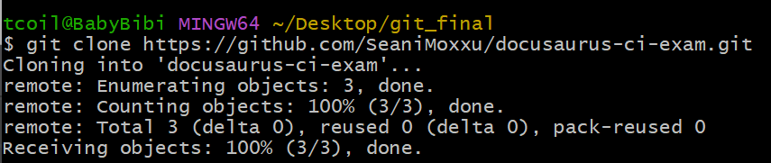
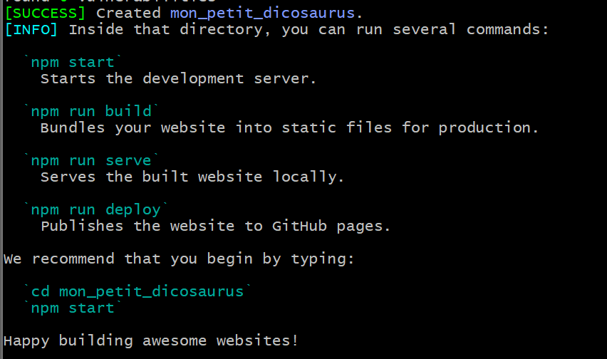
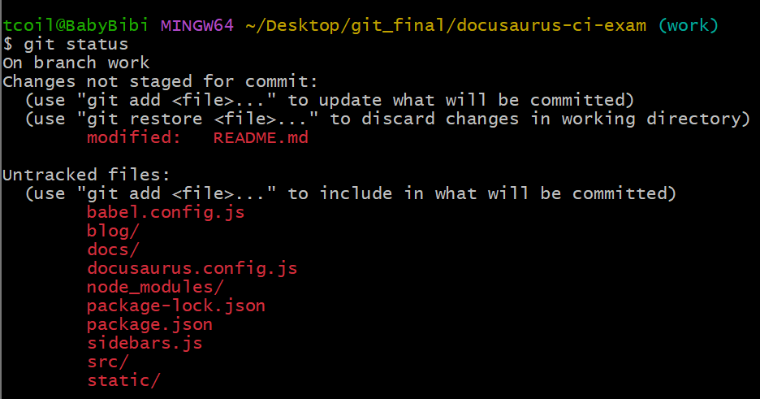
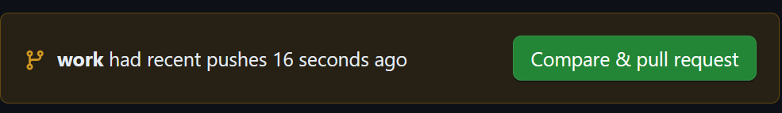
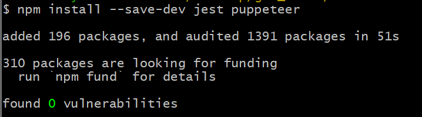
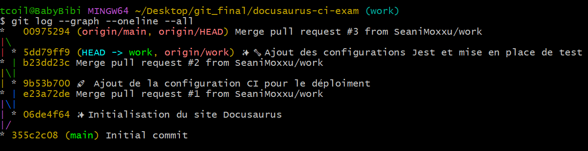
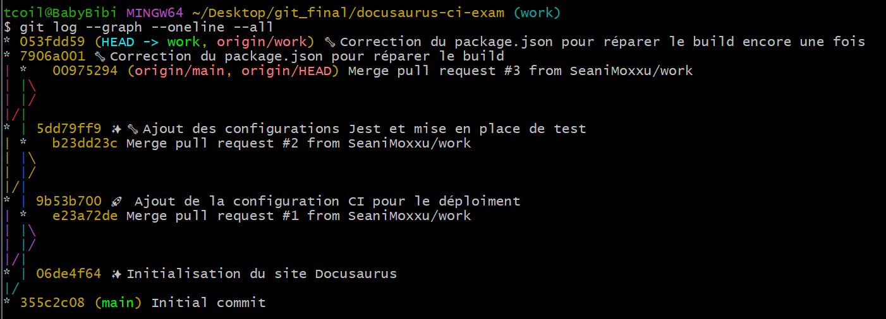

# Initialisation du projet et configuration de Docusaurus.

## 1. Premier clone du dépot

````Bash

````

## 2. Création d'une branch d'innovatio

````Bash
git checkout -b work
````

## 3. Création du site dicosaurus

```Bash
$ npx create-docusaurus@latest mon_petit_dicosaurus classic
```



## 4. Placer le dicosaurus sur le git




## 5. Ajout du workflow

- Création d'un dossier github/workflows et contenue du deploy.yml

````yaml
name: Ajout de Docusaurus a la page github

on:
  push:
    branches:
      - main

jobs:
  build:
    runs-on: ubuntu-latest

    steps:
      - name: Checkout repository
        uses: actions/checkout@v2

      - name: Set up Node.js
        uses: actions/setup-node@v2
        with:
          node-version: 14

      - name: Install dependencies
        run: npm install

      - name: Build Docusaurus site
        run: npm run build

      - name: Deploy to GitHub Pages
        uses: peaceiris/actions-gh-pages@v3
        with:
          github_token: ${{ secrets.GITHUB_TOKEN }}
          publish_dir: ./build
````

- Modification de la config docusaurus

````Javascript
url: 'https://SeaniMoxxu.github.io',
url: 'https://SeaniMoxxu.github.io',

````

## 6. Ajout de jest et puppeteer pour le test

````Bash
npm install --save-dev jest puppeteer
````



-Création d'un fichier de configuration jest a la racine de diconausaurus

````Javascript
module.exports = {
  preset: 'jest-puppeteer',
  testMatch: ['**/tests/**/*.js'],
};
````

- AJout de test trouvé sur internet au dossier tests

````Javascript
const puppeteer = require('puppeteer');
const { execSync } = require('child_process');
const path = require('path');
const fs = require('fs');

describe('Docusaurus Build', () => {
  beforeAll(() => {
    execSync('npm run build', { stdio: 'inherit' });
  });

  it('should generate the build folder', () => {
    const buildDir = path.join(__dirname, '../build');
    expect(fs.existsSync(buildDir)).toBe(true);
  });

  it('should have an index.html file', () => {
    const indexPath = path.join(__dirname, '../build/index.html');
    expect(fs.existsSync(indexPath)).toBe(true);
  });
});

describe('Essential Pages', () => {
  let browser;
  let page;

  beforeAll(async () => {
    browser = await puppeteer.launch();
    page = await browser.newPage();
    await page.goto('file://' + path.resolve(__dirname, '../build/index.html'));
  });

  afterAll(async () => {
    await browser.close();
  });

  it('should load the home page', async () => {
    const title = await page.title();
    expect(title).toBe('Le meilleur docusaurus');
  });

  it('should have a working navigation', async () => {
    await page.click('nav a[href="/docs/intro"]'); // Lien de navigation par défaut
    await page.waitForSelector('.theme-doc-markdown'); // Sélecteur par défaut sur la page de documentation
    const title = await page.$eval('.theme-doc-markdown h1', el => el.textContent);
    expect(title).toBe('Introduction'); // Titre par défaut de la page attendue
  });
});
````

7. Ajout des modifications a git et tests du site



-Erreur lors du build

````Bash
Run npm install
npm error code EJSONPARSE
npm error path /home/runner/work/docusaurus-ci-exam/docusaurus-ci-exam/package.json
npm error JSON.parse Unexpected token "{" (0x7B) in JSON at position 1123 while parsing near "...de\": \">=18.0\"\n  }\n  {\n  \"scripts\": {\n   ..."
npm error JSON.parse Failed to parse JSON data.
npm error JSON.parse Note: package.json must be actual JSON, not just JavaScript.

npm error A complete log of this run can be found in: /home/runner/.npm/_logs/2024-07-24T14_51_13_005Z-debug-0.log
Error: Process completed with exit code 1.
````

- Modification des fichier de configurations


